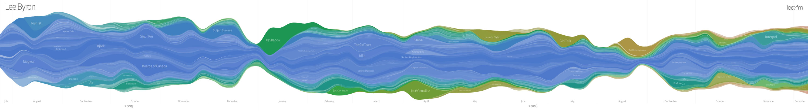
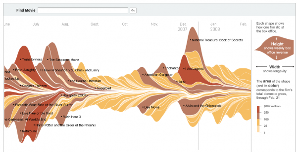
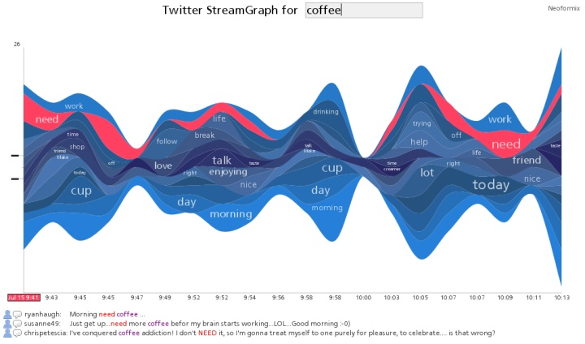

# ECL-DataViz : Stream Graph

## Description

Stream Graphs consist in a variation of a Stacked Area Graph, which means that different categories are piled in order to see the value of each one, but also its contribution to the total. In order to let that happen, different colors are often dedicated to each data. But sometimes, the color is used to show the value of the data.
So just like the Stacked Area Graph, the value of the different data are proportional to the height of the stream shape, and the horizontal axis is often the time. But what differs is that there is no fixed vertical axis to refer to.
Stream Graphs are particularly useful to analyse the trends of high-volume datasets, and they are very aesthetic. But its main drawbacks is that the smaller values are hidden in the large shapes of the higher ones. Another problem is that we can't read the exact value of datasets with these graphs, because there isn't an axis to allow that. However it can be seen as an benefit for thoses who want to focus their reader to the trends and not the values.
As a conclusion the stream graph is a very particular graph, which make him unique and therefore interesting. It's an ideal solution for people who look for aesthetics and trends representations.

*Source: https://datavizcatalogue.com/methods/stream_graph.html*

## Examples

### Listening History

Lee Byron created a stream graph about his listening history with the help of Last.fm that logged the music he listened to. We can see his graph down there.

*Source : http://benfry.com/fall06/lee/*

In this graph, everytime Lee Byron listens to a new artist, this one is added to the borders. The height of the stream shapes shows how much an artist has been listened to. And the color is warm if the artist has been discovered recently, and cold if the artist is known for long. The writings in the shapes shows the artists names.
This stream graph allows the viewer to see easily the trends (like every stream graph), just by loonking the global height. For example we can see that in December 2005 and August 2006, Lee Byron listened fewer music. It's also interesting to be able to see if the artist is listened to and known for a long time (blue color) or not. For a period, the viewer can also know which artist is the favourite at this time.
But once again, the listening ammount can't be accessed by this stream graph, which could be allowed if the graph was interactive, then just flying the mouse over the artist would highlight its evolution. Furthermore it's really hard to follow the evolution of one artist and to study the artists that are not heard often. 

### The Ebb and Flow of Movies

The NY Times made a stream graph to represent the Box Office Receipts from 1986 to 2008 for the main movies.

*Source : http://www.nytimes.com/interactive/2008/02/23/movies/20080223_REVENUE_GRAPHIC.html*

There, the height of a stream shape shows the money that the movie has earned throughout the time. So the wider it is, the longer it has earned money. And the color are used to scale the receipts. The darker it is, the more money the movie made.
A particularity of this graph is the given ability to move throughout time. It allows the graph to have a better scale, even if the data covers a very wide spectrum of time.
Since it is interactive, the viewer see the data highlited when he flies the mouse over it so that the longevity of the movie is clearly shown, and details about the movie are also available. The main movies are clearly visible, as the global trends (if cinema makes a lot of money during a period).
But once again, only the main movies are visible, and every smaller ones are hidden, like the yellow ones.

### Twitter StreamGraphs

An other example is also interesting to present.

*Source : https://www.neoformix.com/2008/TwitterStreamGraphs.html*

This one is a tool in which the user enters a word and a streamgraph is then created. 200 tweets are studied and all those containing the selected word are chosen, and the other words of the tweets are stored. Then a sum is done of all these other words and we can see them in the graph. So he streamsraph shows the usage over time for the words most highly associated with the search word.
In the example, the word coffee is chosen, and for example a lot of tweets also contained the word need.
It's also interactive and if we chose a stream shape, we highlight it and have access to the related tweets.

# Conclusion

As it has been said, the streamgraph is a particular graph which is aesthetic and presents easily the global trends, but is not adapted if the values are important since just their proportions are visible. The first two examples are the most popular streamgraphs and depicts well the strengths and weaknesses of the streamgraphs, described in the first part of this document. Other examples exists on the internet, but they don't show other interesting aspects.
